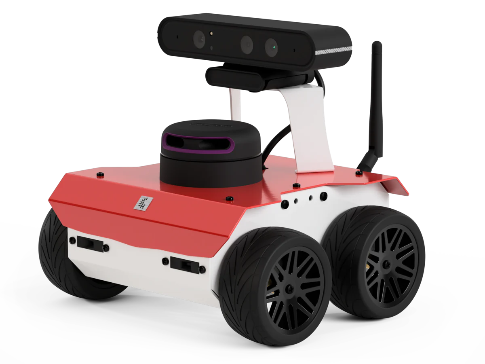
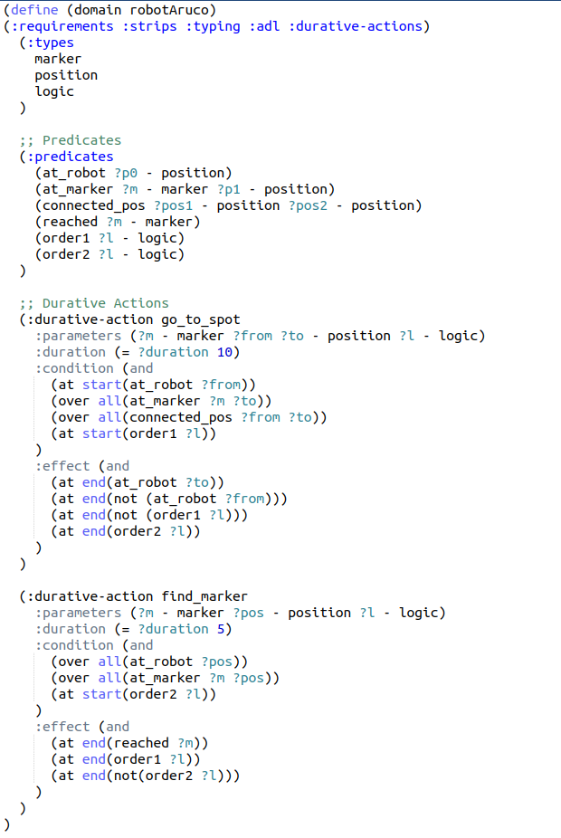
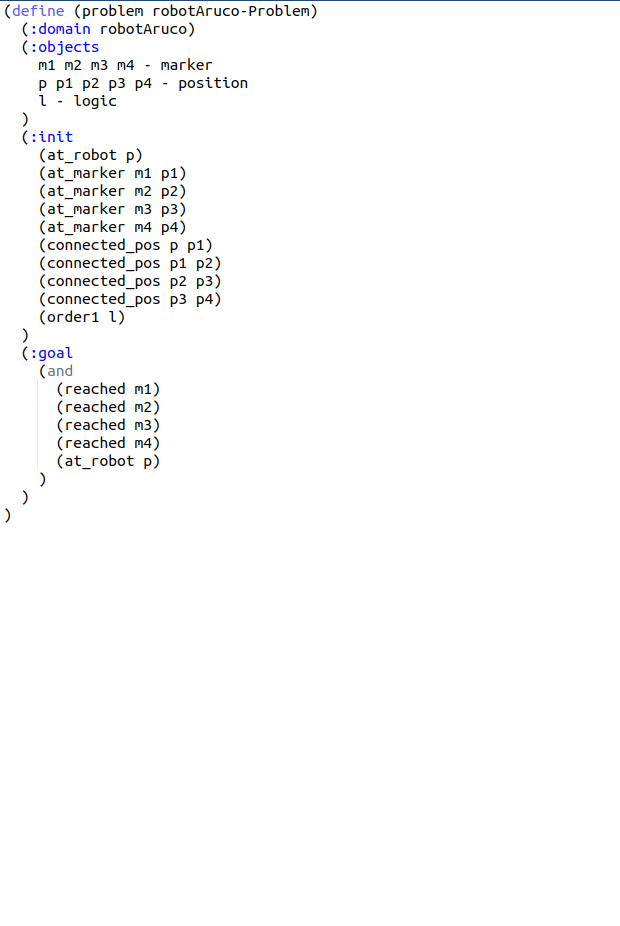

# Experimental Robotics Laboratory - Assignment 2

C. Demaria (s5433737) 🤓

G. Galvagni (s5521188) 🤓

E. Piacenti (s5636699) 🤓

## Description 📑

In this assignment we have developed a ROS2 package that lets a mobile robots , endowed with a camera, do the following tasks:

1) find alla markers in the enviroment.

2) go back to the starting position.

3) get around obstacles using the Bug0 algorithm.

In order to detect the markers ID, the ArUco and the OpenCV packages are being used and the informations about the markers to be reached are:
- marker 11 is visible from the position x = 6.0, y = 2.0
- marker 12 is visible from the position x = 7.0, y = -5.0
- marker 13 is visible from the position x = -3.0, y = -8.0
- marker 15 is visible from the position x = -7.0, y =-1.5

This project is implemented in simulation using the world file assignment2.world.

Lastly, we intend to utilize PlanSys2 as the planning framework to design and synchronize the robot's activities.

## The Robot 🤖

In simulation we are using the model of the ROSbot2R, a mobile robot platform designed for use with the Robot Operating System (ROS), defined in the rosbot_description package.
The robot has a RGBD Camera used to visualize the sourrinding enviroment and detect the interest objects.

<figure>

</figure>
 

## PDDL

The Planning Domain Definition Language (PDDL) file included in this repository (</plansys2_assignment_pkg/pddl>) defines the planning domain for the robotic system. This file specifies the types, predicates, and durative actions necessary for the robot to accomplish the assigned tasks of marker localization and navigation.

Domain Elements:
1) Types:
- marker: Represents markers or points of interest.
- position: Represents locations or positions in the environment.

2) Predicates:
- (at_robot ?p0): Indicates that the robot is at position ?p0.
- (at_marker ?m ?p1): Specifies that marker ?m is at position ?p1.
- (connected_pos ?pos1 ?pos2): Denotes a connection between positions ?pos1 and ?pos2.
- (reached ?m): Indicates that marker ?m has been reached.

3) Durative Actions:
- go_to_marker: Represents the action of the robot moving from position ?from to ?to to reach marker ?m.
- find_marker: Represents the action of the robot finding marker ?m at position ?pos.

These are our domain and problem files:
<figure>
  
  
  <figcaption>Left: PDDL Domain File, Right: PDDL Problem File</figcaption>
</figure>

## THE NODES

**go_to_action_node**

the GoToAction node is designed to be an action executor within the ROS 2 environment and it responsible for executing specific actions within the defined planning domain.
It serves basically as the bridge between the high-level planning specified in the PDDL file and the actual execution of actions on the robotic platform.

Features:
- Extends the ActionExecutorClient class, allowing seamless integration with PlanSys2 actions.
- Utilizes an Action Client (ActionExecutorClient) to manage the execution of the durative action'go_to_marker.'
- Provides a service (/response_go_to) to handle responses and completion status of the 'go_to_marker' action.
- Communicates with an additional service client (/go_to_marker) to trigger the initiation of the 'go_to_marker' action.
- Configurable parameters, such as action_name and timeout_sec, for adapting to specific use cases.

**go_to_point_srv**

The GoToPoint node focuses on robotic navigation by directing the robot to move towards a specified point in its environment. This node utilizes odometry information to adjust the robot's orientation and linear movement. The robot can be switched between an active and inactive state using a service call.

Features:
- Tracks robot state variables including position (x, y) and yaw orientation.
- Implements a finite-state machine to manage different stages of movement.
- Accepts a desired goal position and performs the necessary actions to reach it.
- Utilizes proportional controllers for both angular and linear movements.
- Offers ROS2 services to switch the node's active state and provide feedback on completion.
- Subscribes to odometry and laser scan topics for real-time sensor feedback.
- Provides flexibility in adjusting parameters such as precision, proportional gains, and bounds.

**wall_follow_srv**

This node implements a wall-following behavior based on laser scan data. It switches between different states (finding the wall, turning left, and following the wall) and adjusts the robot's movement accordingly. The state transitions are determined by the presence and distances of obstacles in different regions according to laser scan readings.

Features:
- Subscribes to the /scan topic to receive laser scan data, providing information about the robot's surroundings.
- Implements a wall-following strategy with three distinct states: finding the wall, turning left, and following the wall.
- Exposes a service (/wall_follower_switch) to dynamically activate or deactivate the wall-following behavior.
- Utilizes a finite-state machine to manage different wall-following scenarios.
- Adjusts the robot's velocity and angular velocity using Twist messages to navigate and follow the wall.
- Incorporates configurable distance thresholds (d0 and d) to determine proximity to obstacles and make corresponding decisions.

**bug0**

The Bug0 node is a ROS 2 implementation of the Bug 0 algorithm for mobile robot navigation. The Bug 0 algorithm is a simple method that combines "go-to-point" and "wall-following" behaviors to reach a desired goal point while avoiding obstacles.

Features:
- Utilizes laser scan data and odometry information to navigate in its environment.
- Implements a state machine with three states:
- - Go to point (State 0): The robot moves directly towards the goal point.
- - Wall following (State 1): If an obstacle is encountered during the "go to point" phase, the robot switches to following the wall until a clear path is available.
- - Done (State 2): Indicates successful completion of the goal point or the task.
- Supports a service (/go_to_marker) to trigger the Bug 0 algorithm and start the navigation process.
- Capable of handling asynchronous service calls and continuously adjusts its behavior based on laser readings and robot position.

## Logic of the program 🔄

The pddl domain simply contains two durative-actions: *go_to_marker* and *find_marker*.  

  
**Go_to_marker:**

This durative-action triggers the *go_to_action_node* node, which using a service call enables a bug0 algorithm to work. The *bug0* node manages the behavior of *wall_follow* and *go_to_point* nodes, in order to let the robot reach the desired position avoiding the obstacles met along the path. When the desired position is reached, the *bug0* uses another service call in order to inform the *go_to_action_node* that the goal is concluded.  

**Find_marker:**

This durative-action triggers the *marker_searcher_action* node, which using a service call enables the searching for the marker. The *motor_motion_node* is responsible for letting the robot rotate on itself, while the *camera_check_node* simply tries to detect the aruco marker that from this position should be visible from the robot. When it recognizes the corresponding marker, the robot stops rotating and it gives back to the *marker_searcher_action* node the information that the goal has been reached.

## Install and run ⚙

First of all, you need to download the repository with the following command inside your workspace:

    git clone https://github.com/claudioDema99/ExpLab-FirstAssignment

From the root directory of your ROS2 workspace run the command:

    colcon build

Now, you have to install `konsole` with the command:

    sudo apt-get install konsole

Inside the `/src/ExpLab-FirstAssignment` of your root directory and use:

    chmod u+x launch_exp.sh
    
Finally, to run the code, type the following command:

    bash launch_exp.sh

## Videos 📼

The video showcasing the robot's motion in the Gazebo environment as it navigates and interacts with its surroundings. The video provides a visual representation of how the robot responds to the environment, demonstrating its movements and behaviors:

https://github.com/claudioDema99/ExpLab-FirstAssignment/assets/114250896/425a8420-1c74-4e93-bcef-bf3c2a1b7a72

The robot's camera through an Rviz video, offering a glimpse into its perspective and visual observations. Gain insight into what the camera captures and how it operates:

https://github.com/claudioDema99/ExpLab-FirstAssignment/assets/114250896/50d890b1-f94b-49b8-abd3-637680c6a316

## Possible improvements 📈

We attempted to implement an action-client server for motion control, integrating relative positions obtained from the camera with respect to the robot's frame and absolute positions from odometry. During initial tests using known relative positions, the robot exhibited precise movements—moving perpendicularly to each marker and stopping accurately.

However, when we incorporated coordinates obtained from the camera, the robot's motion became erratic. After conducting numerous tests, we identified a potential issue with the relative positions due to the lack of camera calibration.

To enhance the system, we are considering camera calibration to rectify the inaccuracies associated with the relative positions. This calibration process aims to improve the accuracy of the camera data, which should subsequently result in more reliable and precise robot movements. Probabily, after calibration we will assess the impact on the overall performance of the action-client server for motion control.

